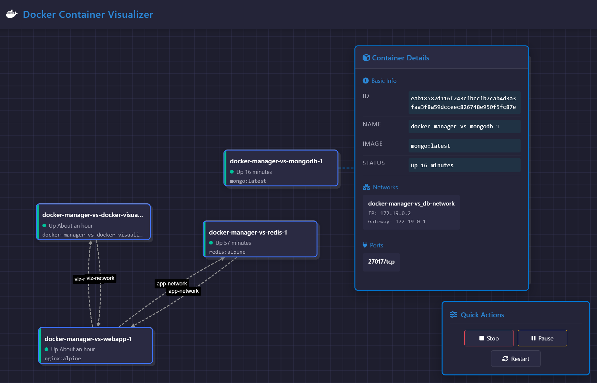

<div align="center">
  
# 🐳 Docker Container Visualizer
### *Vibe coding using cursor ai*

[](https://github.com/opestro/docker-container-visualizer/stargazers)
[](LICENSE)
[](https://github.com/opestro)



### Beautiful Blueprint-Style Docker Container Visualization

<p align="center">
    <a href="#features">Features</a> •
    <a href="#installation">Installation</a> •
    <a href="#usage">Usage</a> •
    <a href="#docker-support">Docker</a> •
    <a href="#contributing">Contributing</a>
</p>

</div>

---

## ✨ Features

<div align="center">

| Feature | Description |
|---------|-------------|
| 🎨 Blueprint Style | Modern interface with professional dark theme |
| 🔄 Real-time Updates | Auto-refresh functionality every 10 seconds |
| 🔍 Interactive Details | Click nodes to view detailed container info |
| 🌐 Network Mapping | Visual representation of container relationships |
| 💾 State Persistence | Maintains position and zoom state |
| ✨ Visual Effects | Professional glow effects and animations |
| 🎮 Container Controls | Intuitive action panel to manage containers |
| 🏷️ Enhanced Labels | Clear network names with improved visibility |

</div>

## 🛠 Tech Stack

<div align="center">

[](https://nodejs.org/)
[](https://expressjs.com/)
[](https://www.docker.com/)
[](https://developer.mozilla.org/en-US/docs/Web/JavaScript)
[](https://js.cytoscape.org/)

</div>

## 🚀 Installation

```bash
# Clone the repository
git clone https://github.com/opestro/docker-container-visualizer.git

# Navigate to project directory
cd docker-container-visualizer

# Install dependencies
npm install

# Start the application
npm start
```

Access the visualization at: `http://localhost:3001`

## 💡 Usage

<div align="center">

| Action | Description |
|--------|-------------|
| 🖱️ Click Container | View detailed container information |
| 🔄 Drag | Rearrange container nodes for better visualization |
| 🔍 Zoom | Mouse wheel to zoom in/out of the graph |
| 🌐 Pan | Click and drag background to navigate |
| ⚙️ Container Actions | Manage containers with intuitive action buttons |
| ❌ Background Click | Close open details panels |

</div>

### 🎮 Container Management

The application allows you to perform the following actions on containers:

- **Start** - Start a stopped container
- **Stop** - Stop a running container
- **Pause** - Pause a running container
- **Resume** - Resume a paused container
- **Restart** - Restart a container
- **Remove** - Remove a container from the system

All actions are available through an intuitive action panel that automatically adapts to the container's current state.

## 🐋 Docker Support

```bash
# Run with Docker Compose
docker-compose up -d
```

## 🤝 Contributing

Contributions are what make the open-source community such an amazing place to learn, inspire, and create. Any contributions you make are **greatly appreciated**.

1. Fork the Project
2. Create your Feature Branch (`git checkout -b feature/AmazingFeature`)
3. Commit your Changes (`git commit -m 'Add some AmazingFeature'`)
4. Push to the Branch (`git push origin feature/AmazingFeature`)
5. Open a Pull Request

## 👨‍💻 Developer Contact

<div align="center">
  
### Mehdi Harzallah

[](https://linkedin.com/in/mehdi-harzallah)
[](https://github.com/opestro)
[](https://wa.me/213778191078)

📧 **Email**: mahdiharzallah21@gmail.com  
📱 **Phone/WhatsApp**: +213 778191078

</div>

## 📄 License

This project is licensed under the MIT License - see the [LICENSE](LICENSE) file for details.

---

<div align="center">

### Made with ❤️ by Mehdi Harzallah

<br>

[](https://visitorbadge.io/status?path=opestro%2Fdocker-container-visualizer)

</div>
